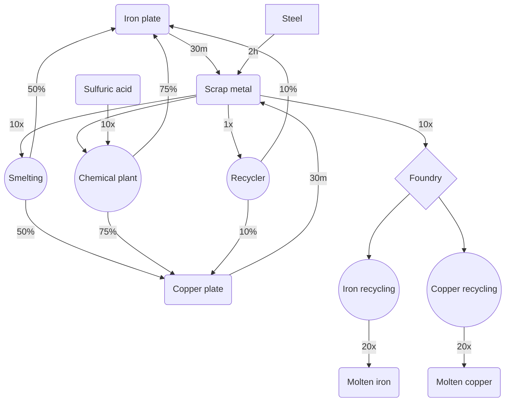
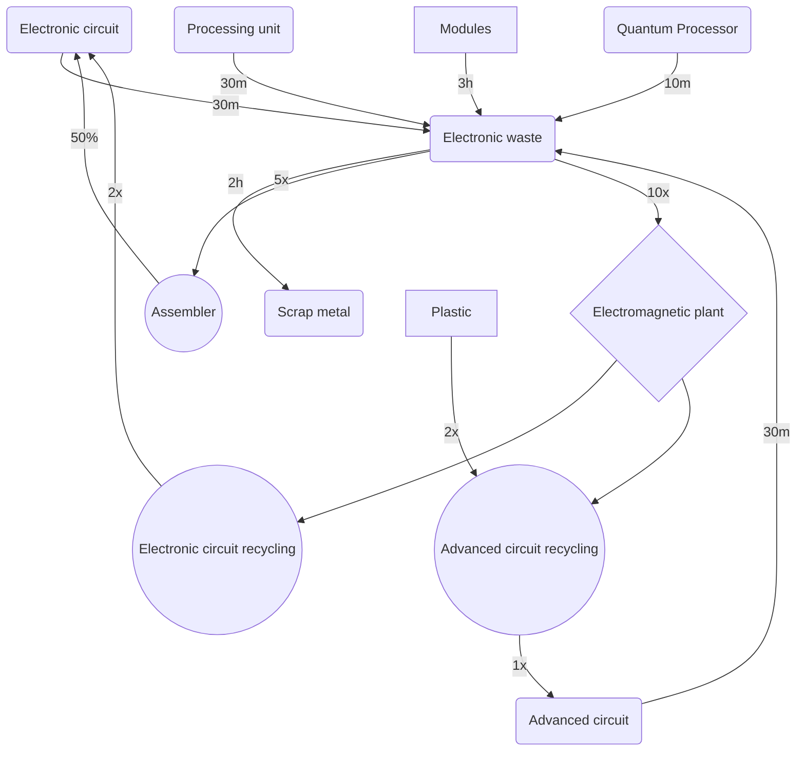

## Metal

```mermaid
flowchart

Iron(Iron plate) -->|30m| metal_scrap(Scrap metal)
Copper(Copper plate) -->|30m| metal_scrap(Scrap metal)
Steel -->|2h| metal_scrap(Scrap metal)
metal_scrap -->|10x| smelting((Smelting))
metal_scrap -->|10x| foundry{Foundry}
metal_scrap --> chemical((Chemical plant))
smelting -->|50%| Iron
smelting -->|50%| Copper
foundry --> recipe_iron((Iron recycling))
recipe_iron -->|20x| molten_iron(Molten iron)
foundry --> recipe_copper((Copper recycling))
recipe_copper -->|20x| molten_copper(Molten copper)
acid(Sulfuric acid) -->|10x| chemical
chemical -->|75%| Iron
chemical -->|75%| Copper
metal_scrap -->|1x| recycler((Recycler))
recycler -->|10%| Iron
recycler -->|10%| Copper
```

Ratios:
Smelting: 10:1
Chemical:10:1.5
Foundry: 10:1.5
Recycler: 10:2

## Electronics

```mermaid
flowchart
green(Electronic circuit) -->|30m| waste(Electronic waste)
red(Advanced circuit) -->|30m| waste
blue(Processing unit) -->|30m| waste
Modules --> |3h| waste
waste -->|2h| metal_scrap(Scrap metal)
quantum(Quantum Processor) -->|10m| waste
waste -->|5x| assembler((Assembler))
assembler -->|50%| green
waste -->|10x| em{Electromagnetic plant}
em --> gc_recipe((Electronic circuit recycling))
gc_recipe -->|2x| green
em --> rc_recipe((Advanced circuit recycling))
Plastic -->|2x| rc_recipe
rc_recipe -->|1x| red
```
